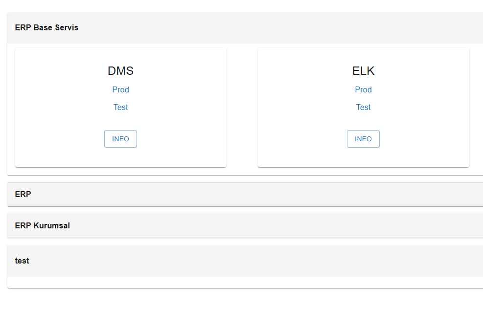
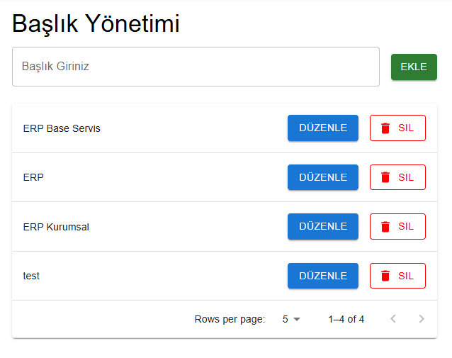
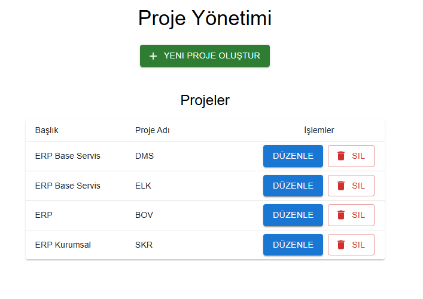
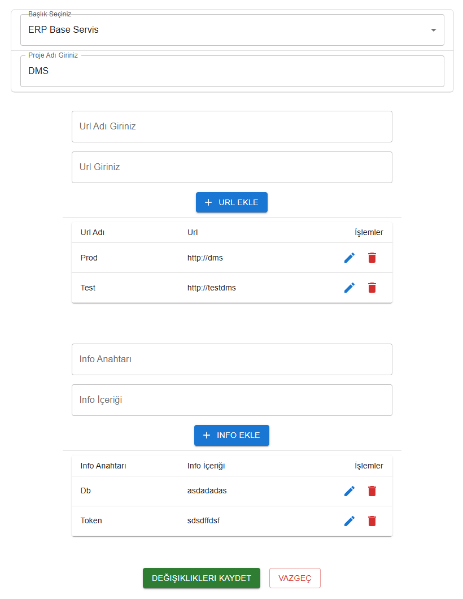
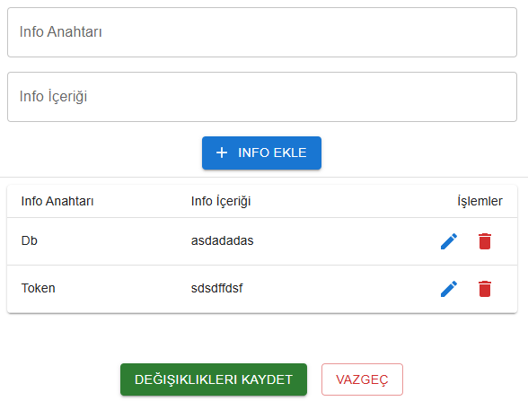
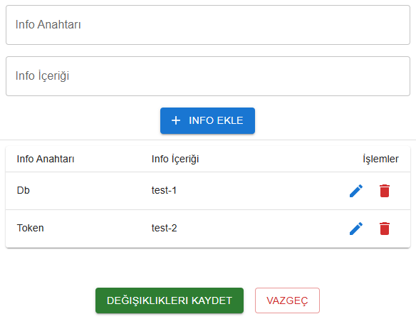

# 🚀 Proje Yönetim Paneli

Bu proje, React ve Material UI kullanılarak geliştirilmiş bir **Proje Yönetim Paneli** uygulamasıdır. Kullanıcılar, projelere ait **başlık**, **proje adı**, **URL içerikleri** ve **bilgi notlarını (Info)** yönetebilmektedir.

---

## 🧩 Kullanılan Teknolojiler

- ⚛️ **React JS** – Bileşen tabanlı frontend yapısı
- 🎨 **Material-UI (MUI)** – Modern ve responsive UI bileşenleri
- 🗃️ **State Management (useState)** – Yerel veri yönetimi
- 💡 **Modular Component Design** – Kodun okunabilirliği ve yeniden kullanılabilirliği için bileşen yapısı
- 📝 **Markdown + GitHub** – Projeyi açık kaynak olarak paylaşma

---

## 🛠️ Proje Özellikleri

### ✅ Proje Oluşturma
- Başlık seçimi (Dropdown)
- Proje adı girme alanı (TextField)
- URL ve Info alanlarını tablo halinde oluşturma
- Oluşturulan projeleri listeleme

### ✅ Projeler Tablosu
- Projeleri tablo halinde görüntüleme
- Her proje için “Düzenle” ve “Sil” işlemleri
- Modal üzerinden düzenleme

### ✅ Info ve URL Yönetimi
- Projeye özel bilgi ve bağlantı (info, url) ekleme ve düzenleme
- Modal içinde yeni info/url ekleme
- Her bir bilgi için ayrı düzenleme ve silme ikonları

---

## 📷 Ekran Görüntüleri

### 🏠 Anasayfa
Ana karşılama ekranı – kullanıcıyı yönlendirici bir yapı


---

### 📁 Başlık Yönetimi Sayfası
Başlıklar arasında CRUD işlemleri gerçekleştirme


---

### 🧱 Proje Yönetimi Paneli
Proje oluşturma ve listeleme işlemlerinin yapıldığı ana panel


---

### ➕ Proje Ekleme Modalı
Başlık seçme, proje adı yazma, URL ve info ekleme alanlarıyla dinamik form yapısı


---

### ✏️ Proje Düzenleme – URL ve Info Görünümü
Var olan projenin içeriğini modal ile düzenleme imkanı


---

### 🛠️ Proje Düzenleme Devamı
URL ve Info düzenleme alanları, silme ve kaydetme seçenekleri


---

## 🚀 Kurulum Adımları

Projeyi çalıştırmak için aşağıdaki adımları takip edebilirsin:

```bash
git clone https://github.com/kullaniciadiniz/proje-yonetim-paneli.git
cd proje-yonetim-paneli
npm install
npm start
